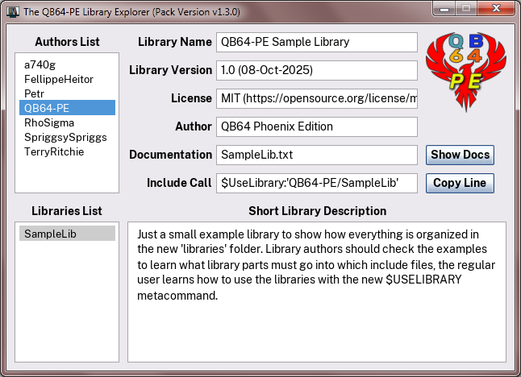

# The QB64-PE Libraries Pack
This folder contains selected user libraries from which we think they are worth to be distributed as an dedicated package for easy use in **QB64-PE v4.3.0 and up**. However, the libraries are not part of the QB64-PE package itself, but are hosted in its own GitHub repository as an extra add-on package. This allows us to independently update/release the libraries without the need of a complete new QB64-PE release. As the libraries are not part of QB64-PE nor are its SUBs and FUNCTIONs part of the QB64 language, we also can't guarantee they will work forever. Maintenance is under the obligation of the respective library authors. We will try to update this package as soon as possible when any of the hosted libraries got an update, but we also reserve the right to remove a library completely if it is not properly working anymore and no longer maintained by its author.

The **Library Explorer** can be used to easily browse through all the libraries in the Pack and get an idea of what's available. You first need to compile it from the provided source code. The best place for the executable is probably right in the QB64-PE main folder just along the QB64pe executable, but it also works if you move it into the `libraries` folder.

## The $USELIBRARY Metacommand
### The new easy library includer!
Any of the libraries can be easily pulled into your code with the new `$USELIBRARY:'author/library'` metacommand ([Wiki page](https://qb64phoenix.com/qb64wiki/index.php/$USELIBRARY)) in the beginning lines of your program. This new metacommand makes sure that every required library file is automatically included in the right place to work properly. The **Library Explorer** generates the metacommand for the currently selected library and you may copy it there and then paste it into your program. Look into the folder `libraries/examples` for usage examples.

### Can I use it for other libraries too?
Not directly, the $USELIBRARY metacommand was especially designed to serve our new Libraries Pack and it depends on the layout of the `libraries` folder. However, once you understood how the data is organized within that folder, you can of course drop in other libraries to make them usable with the new $USELIBRARY metacommand. If you wanna make it correct and maybe with the intention to provide it for other users too, then check out the [Contributors](Contributors.md) document, you're welcome to incorporate and share your work.

### Can I use it with older QB64-PE versions than v4.3.0?
No, the $USELIBRARY metacommand is new in **QB64-PE v4.3.0**, older versions simply don't have it. However, when removing the v4.3.0 version checks from all the files, then you could use the traditional way of $INCLUDE'ing the libraries. But to be honest, that is probably more work than simply upgrading to **QB64-PE v4.3.0** or up.
