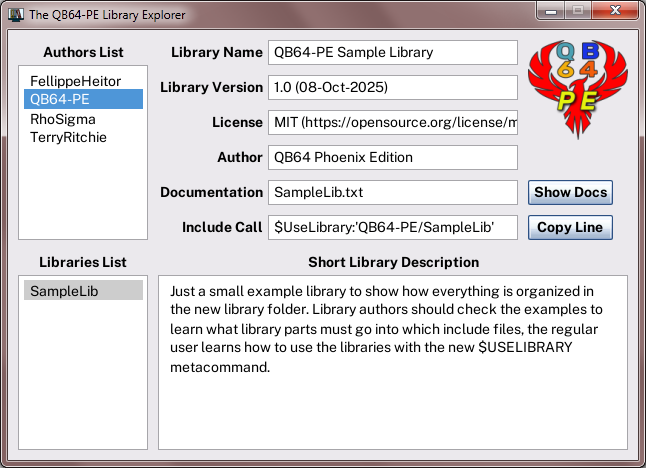

# The QB64-PE Libraries Pack
This folder contains selected user libraries from which we think they are worth to be distributed as an dedicated package for easy use in **QB64-PE v4.3.0 and up**. However, the libraries are not part of the QB64-PE packages itself, but are hosted in its own GitHub repository as an extra add-on package. This allows us to independently update/release the libraries without the need of a complete new QB64-PE release. As the libraries are not part of QB64-PE nor are its SUBs and FUNCTIONs part of the QB64 language, we also can't guarantee they will work forever. Maintenance is under the obligation of the respective library authors. We will try to update this package as soon as possible when any of the hosted libraries got an update, but we also reserve the right to remove a library completely if it is not properly working anymore and no longer maintained by its author.

The **Library Explorer** can be used to easily browse through all the libraries in the Pack and get an idea of what's available. You first need to compile it from the provided source code. The best place for the executable is probably right in the QB64-PE main folder just along the QB64pe executable, but it also works if you move it into the `libraries` folder.

### $USELIBRARY The new easy library includer!
Any of the libraries can be easily pulled into your code with the new `$USELIBRARY:'author/library'` metacommand (since **QB64-PE v4.3.0**) in the beginning lines of your program. This new metacommand makes sure that every required library file is automatically included in the right place to work properly. The **Library Explorer** generates the metacommand for the currently selected library and you may copy it there and then paste it into your program.

### Can I use it for other libraries too?
Not directly, the $USELIBRARY metacommand was especially designed to serve our new Libraries Pack and depends on the layout of the `libraries` folder. However, once you understood how the data is organized within that folder, you could of course drop in other libraries to make them usable with the new $USELIBRARY metacommand. Note that we do not recommend that practice, as updates of the Libraries Pack could easily overwrite your dropped-in files. If you wanna take that risk, then go ahead and drop in other libraries, but we recommend to keep the traditional way of $INCLUDE'ing all those libraries not in the Pack (yet).

### Well, may I suggest other libraries for inclusion into the Pack then?
Sure you can, as we don't know of all libraries out there, any suggestions are welcome. Give us a hint where to find a library (Forum link etc.) and we'll check if the library meets the requirements for inclusion. If it's one of your own libraries you wanna see in the Pack, then check out the [Contributors](Contributors.md) document, you're welcome to open **Pull Requests** in the [QB64-PE Libraries Pack](https://github.com/QB64-Phoenix-Edition/QB64-PE-LibrariesPack) repository.

### Can I use the Libraries Pack with older QB64-PE versions than v4.3.0?
No, all libraries in the pack enforce **QB64-PE v4.3.0** even if they maybe would work with earlier versions. That is to serve the future and going forward from here. Insisting on backward compatibility for a brand new package is the wrong direction for development, so we repeat the words from above. If you hang on to outdated QB64-PE versions for whatever reasons, then get the libraries of your interest from the respective Forum sources and keep the traditional way of $INCLUDE'ing them.
